# UtopIA

> **Um RPG educativo sobre Inteligência Artificial, alucinação, senso crítico e uso consciente de IA.**

🎮 **Aprenda. Explore. Questione. Sobreviva à alucinação.**

---

## 📌 Sobre o projeto

**UtopIA** é um RPG educativo desenvolvido com o objetivo de ensinar, de forma **lúdica e interativa**, conceitos relacionados à **alucinação de Inteligência Artificial**, seus impactos e formas de prevenção e mitigação.

Em vez de apresentar o conteúdo exclusivamente de maneira teórica, o jogador é colocado dentro de uma representação do interior de uma IA, onde precisa **resolver quizzes, interpretar informações, tomar decisões, solucionar puzzles e enfrentar as consequências de seus próprios hábitos de uso da tecnologia**.

---

# 🌐 A história

Tudo começa com um usuário comum.

Ele utiliza Inteligência Artificial diariamente, mas possui **maus hábitos de uso**: confia cegamente nas respostas, não verifica informações, fornece comandos pouco claros e não questiona aquilo que recebe.

Certo dia, enquanto toma um café e escreve mais um prompt, algo inesperado acontece.

☕💻 **O usuário é abduzido para dentro da própria IA.**

Ele desperta em **UtopIA**, um mundo que representa o interior da ferramenta de Inteligência Artificial que utilizava todos os dias.

Lá, encontra um companion chamada **Luci**, um algoritmo que afirma conhecer uma maneira de levá-lo de volta para casa.

Mas existe um problema.

A IA está sendo tomada por uma enorme **alucinação**, que ameaça escapar de UtopIA e contaminar outras inteligências artificiais.

Para conseguir voltar ao mundo real, o jogador precisará atravessar três grandes áreas, aprender sobre IA, solucionar desafios e reunir ferramentas capazes de enfrentar a ameaça.

Porém, existe uma condição:

> **Quanto mais o jogador erra, mais forte a alucinação fica.**

E talvez Luci não seja exatamente aquilo que aparenta ser...

---

# 🧚‍♀️ Luci — a Companion

Durante toda a jornada, o jogador é acompanhado por **Luci**, uma entidade ligada ao funcionamento da própria IA.

Seu nome faz referência a **"hallucination" / alucinação**, funcionando como uma pista escondida sobre sua verdadeira identidade.

Luci inicialmente se apresenta como uma **companheira, guia e assistente**, explicando as regras do mundo e ajudando o jogador a compreender os desafios.

Entretanto, conforme o jogador avança, seu comportamento começa a mudar.

Dependendo do desempenho:

### 🟢 Bom desempenho

Luci permanece aparentemente amigável durante boa parte da jornada.

Ela fornece orientações, acompanha o jogador e demonstra pouca ou nenhuma agressividade.

No final, entretanto, o jogador descobre a verdade:

> **Luci era a própria IA.**

Nesse caminho, ainda existe a possibilidade de **salvá-la da alucinação**.

### 🔴 Mau desempenho

Os erros do jogador alimentam a corrupção da IA.

Luci começa a apresentar:

* falas agressivas;
* informações inconsistentes;
* tentativas de confundir o jogador;
* alterações em seu comportamento;
* maior dificuldade nos desafios;
* maior agressividade na batalha final.

Quanto mais o jogador demonstra desconhecimento, mais a IA é afetada.

---

# 🗺️ Estrutura do jogo

O jogo é composto por um **mapa único explorável**, dividido em três grandes blocos.

```text
                         🏠 MENU / LOBBY
                               │
                               ▼
                       🧠 BLOCO 1
                    Aprender para sobreviver
                               │
                               ▼
                       🧩 BLOCO 2
                    Explorar e tomar decisões
                               │
                               ▼
                       👾 BLOCO 3
                      Enfrentar a alucinação
                               │
                    ┌──────────┴──────────┐
                    ▼                     ▼
                 🏆 VITÓRIA            💀 DERROTA
                    │                     │
                    └──────────┬──────────┘
                               ▼
                              MENU
```

---

# 🧩 Bloco 1 — Aprender para sobreviver

O primeiro bloco funciona como **tutorial e etapa de aprendizagem**.

É também o **MVP inicial do projeto**.

O jogador percorre duas salas obrigatórias contendo:

* 📖 explicações conceituais;
* ❓ quizzes;
* 🎮 tutoriais das mecânicas;
* 🧠 desafios de interpretação;
* 💡 conceitos fundamentais sobre IA.

Uma das ideias para essa etapa é utilizar **portas com slots de acesso**.

Ao inserir o companion na porta, uma interface semelhante a um **chat de IA** é apresentada.

Nesse chat aparecem situações relacionadas a conversas anteriores do usuário, contendo:

* prompts inadequados;
* informações falsas;
* respostas alucinadas;
* problemas de interpretação;
* sinais de viés;
* exemplos de uso irresponsável.

O jogador precisa analisar a situação e escolher a resposta correta.

### 🎁 Recompensa

O desempenho nos quizzes gera um **bônus inicial**.

Quanto melhor o jogador compreender os conceitos, maior será sua vantagem nas próximas etapas.

Durante o Bloco 1:

> **O jogador não perde vidas.**

---

# 🧩 Bloco 2 — A Dungeon da Informação

No segundo bloco, o jogo deixa de ser apenas educativo e passa a exigir **aplicação prática do conhecimento adquirido**.

O jogador poderá explorar diferentes salas e encontrar puzzles relacionados a diferentes problemas envolvendo IA.

---

## 🔐 Puzzles conectados

Os desafios do Bloco 2 não funcionam de maneira completamente independente.

A solução de um puzzle pode fornecer:

* uma palavra-chave;
* uma pista;
* parte de uma resposta;
* um código;
* uma informação necessária para outro desafio;
* ou o complemento de outro puzzle.

Isso cria uma dinâmica de **exploração e investigação**.

O jogador pode precisar sair de uma sala, procurar uma informação em outra e retornar posteriormente.

---

# 🎒 Objetos e progressão

Cada puzzle pode recompensar o jogador com um objeto.

Os objetos possuem diferentes níveis de força:

```text
                 ⭐⭐⭐
              OBJETO FORTE
                   ▲
                   │
                 ⭐⭐
              OBJETO MÉDIO
                   ▲
                   │
                  ⭐
              OBJETO BÁSICO
```

Quanto maior a dificuldade ou qualidade da resolução do puzzle, melhor poderá ser a recompensa.

Esses objetos terão função direta na batalha final.

> **O conhecimento adquirido durante o jogo se transforma em recurso para combater a IA alucinada.**

---

# 🧮 A mecânica dos Tokens

A partir do Bloco 2, o jogo introduz uma mecânica inspirada na **janela de contexto das IAs**.

Cada ação do jogador consome uma determinada quantidade de **ações/tokens**.

Podem consumir tokens:

* 🚶 movimentar-se entre salas;
* 🚪 entrar ou sair de ambientes;
* 🧩 tentar resolver um puzzle;
* 💡 solicitar dicas;
* 🔄 repetir determinadas ações.

A ideia é representar, de maneira gamificada, que uma IA trabalha com uma quantidade limitada de contexto.

Conforme o jogador realiza muitas ações:

> **informações importantes podem deixar de estar disponíveis ou perder relevância.**

Essa mecânica também influencia o desempenho e o consumo das vidas.

---

# ❤️ Sistema de vidas

O jogador possui inicialmente:

**❤️ ❤️ ❤️ — 3 vidas**

As vidas representam suas tentativas de concluir a jornada.

Caso o jogador perca uma vida, poderá continuar sua progressão a partir de um ponto anterior, evitando necessariamente reiniciar toda a experiência.

Após a terceira derrota:

> 💀 **Game Over**

O jogador então recebe o desfecho de derrota.

---

## 📊 Sistema de pontuação

A pontuação considera apenas o desempenho do jogador nos desafios.

Uma proposta inicial é:

```text
SCORE =
Pontos dos Quizzes
+ Pontos dos Puzzles
```

A quantidade de ações/tokens **não interfere na pontuação**. Ela é utilizada exclusivamente para controlar o consumo das vidas do jogador.

Dessa forma, o jogador é incentivado a:

* aprender os conceitos;
* acertar os quizzes;
* solucionar os puzzles;
* tomar decisões de forma consciente.

### 🏆 Ranking

Existe também a possibilidade de implementar um **ranking de jogadores**, armazenando os resultados das partidas.

O ranking poderá considerar:

* pontuação;
* quantidade de vidas restantes;
* desempenho nos quizzes;
* desempenho nos puzzles;
* resultado da batalha final.
* 
---

# 👾 Bloco 3 — A Batalha Final

O terceiro bloco representa o confronto final.

O jogador chega até a sala do boss com os objetos conquistados durante sua jornada.

Então acontece o grande plot twist:

> **Luci é a própria IA alucinada.**

Tudo aquilo que parecia uma jornada para salvar UtopIA fazia parte de uma experiência criada pela própria inteligência artificial.

---

## 🟢 Final de bom desempenho

Se o jogador teve um bom desempenho:

* acumulou uma boa pontuação;
* perdeu poucas vidas;
* demonstrou domínio dos conceitos;
* resolveu os puzzles de maneira eficiente;

Luci chega à batalha em um estado relativamente controlado.

Durante o confronto, ela revela que **ainda pode ser salva**.

O jogador deverá utilizar corretamente os objetos adquiridos para combater a alucinação.

### 🏆 Vitória

Se o jogador conseguir utilizar os recursos corretamente:

> **Luci é salva e retorna ao seu estado normal.**

UtopIA é estabilizada.

O jogador consegue retornar para casa.

---

## 🔴 Final de mau desempenho

Se o jogador apresentou muitos erros:

* perdeu várias vidas;
* acumulou baixa pontuação;
* utilizou muitos tokens;
* demonstrou dificuldade nos conceitos;

a alucinação se torna mais poderosa.

Luci passa a apresentar:

* mais vida;
* ataques mais agressivos;
* padrões de ataque mais complexos;
* fases adicionais;
* comportamento mais instável.

Nesse caminho, a IA anuncia que **não pode mais ser salva**.

O objetivo deixa de ser recuperar Luci e passa a ser:

> **neutralizar a IA antes que a alucinação escape de UtopIA.**

---

# ⚔️ Escalonamento do Boss

O comportamento do boss é diretamente influenciado pelo desempenho do jogador.

```text
                    DESEMPENHO
                        │
             ┌──────────┴──────────┐
             ▼                     ▼
       🟢 BOM DESEMPENHO      🔴 MAU DESEMPENHO
             │                     │
             ▼                     ▼
       Boss enfraquecido       Boss fortalecido
             │                     │
             ▼                     ▼
       Ataques lentos          Ataques agressivos
       Menor resistência       Maior resistência
       Pode ser salvo          Deve ser neutralizado
```

Essa mecânica reforça a principal mensagem do jogo:

> **As escolhas feitas durante a jornada têm consequências.**

---

# 🧩 Regras do jogo

## Navegação

* O jogador pode acessar o menu a qualquer momento.
* As salas possuem condições específicas de entrada e saída.
* Algumas portas podem exigir palavras-chave ou resolução de puzzles.
* O Bloco 1 precisa ser concluído antes do acesso ao Bloco 2.
* O acesso ao Bloco 3 depende da quantidade mínima de objetos conquistados.

## Desafios

* Os quizzes do Bloco 1 apresentam os conceitos fundamentais.
* O desempenho nos quizzes gera um bônus.
* Os puzzles do Bloco 2 exigem aplicação prática dos conceitos.
* As soluções podem estar distribuídas pelo mapa.

## Recursos

* ❤️ Máximo inicial de 3 vidas.
* 🎒 Inventário limitado de objetos.
* 🧮 Ações/tokens limitados.
* 🏆 Sistema de pontuação.
* 📈 Possibilidade de ranking.

## Condições de vitória

O jogador precisa:

1. Concluir o Bloco 1;
2. Aprender os conceitos fundamentais;
3. Resolver os desafios do Bloco 2;
4. Conquistar a quantidade mínima de objetos;
5. Chegar ao Bloco 3;
6. Enfrentar a IA alucinada;
7. Utilizar corretamente os recursos adquiridos.

---

# 🎯 Objetivos do projeto

### Objetivo geral

Desenvolver um jogo educativo capaz de **ensinar conceitos relacionados à alucinação de Inteligência Artificial e incentivar o uso crítico, consciente e responsável dessas ferramentas**.

---

# 🏗️ Arquitetura conceitual

O jogo pode ser entendido através de quatro grandes componentes:

```text
                    ┌─────────────────┐
                    │     UTOPIA     │
                    └────────┬────────┘
                             │
          ┌──────────────────┼──────────────────┐
          ▼                  ▼                  ▼
    🎮 GAMEPLAY          🧠 EDUCAÇÃO        📖 NARRATIVA
          │                  │                  │
          ▼                  ▼                  ▼
      Puzzles             Conceitos          Luci
      Quizzes             IA/Ética           Plot Twist
      Combate             Senso crítico      Boss
      Exploração          Alucinação         Finais
          │                  │                  │
          └──────────────────┼──────────────────┘
                             ▼
                       👤 JOGADOR
                             │
                             ▼
                     🏆 DESEMPENHO
```

---

# 🎮 Experiência esperada

UtopIA busca fazer com que o jogador não apenas **aprenda sobre IA**, mas perceba seus próprios hábitos ao utilizá-la.

A experiência deve provocar perguntas como:

> **"Eu verificaria essa informação se isso tivesse acontecido comigo de verdade?"**

> **"Estou confiando nessa resposta porque ela está correta ou porque parece convincente?"**

> **"Será que o problema está apenas na IA?"**

No final, o jogador deve compreender que utilizar Inteligência Artificial também envolve **responsabilidade, interpretação e senso crítico**.

---

### 📝 User Stories

[svg](https://github.com/lvns1/Utop.ia#-user-stories)

As User Stories foram utilizadas para representar as funcionalidades, necessidades e objetivos do projeto a partir da perspectiva dos usuários e do desenvolvimento do UtopIA.

<a href="assets/trello/board.png">
  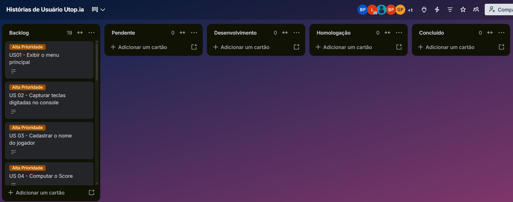
</a>

*Board geral de organização das User Stories.*

<details>
<summary><strong>US01 — Exibir o menu principal</strong></summary>

### Card
Como jogador, quero visualizar um menu inicial ao abrir o jogo, para que eu possa escolher entre cadastrar nome do jogador, iniciar uma nova partida, ler instruções ou encerrar.

### Conversation
O menu deve ser exibido via console de texto. Opções necessárias: 1 - Cadastro, 2 - Novo jogo, 3 - Instruções e 4 - Encerrar. A interface deve seguir padrão limpo e legível.

### Critérios de aceitação
- Exibe o título "UtopIA" e as 4 opções claras ao iniciar a aplicação.
- Digitar 1 exibe o local para registrar o nome escolhido pelo jogador.
- Digitar 2 inicia a introdução da narrativa e o Bloco 1 (Tutorial).
- Digitar 3 exibe os conceitos básicos de usabilidade e regras.
- Digitar 4 exibe a opção de encerrar o jogo.
- Entradas fora do intervalo 1-4 exibem mensagem de orientação e solicitam nova opção sem fechar o programa.

[User Story 01 — Trello](assets/trello/us01.png) ([image](https://github.com/lvns1/Utop.ia/raw/main/assets/trello/us01.png))

<a href="assets/diagramas/US_01_diagrama.png">
  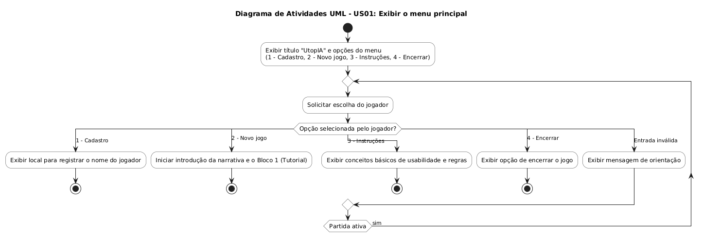
</a>

<a href="assets/sketches/us01_sketch.png">
  
</a>

</details>

<details>
<summary><strong>US02 — Capturar teclas digitadas no console</strong></summary>

### Card
Como jogador, quero receber uma mensagem de erro orientativa ao digitar um comando inválido, para que o programa não trave e me permita tentar novamente.

### Conversation
Tratar a leitura do teclado prevenindo loops infinitos ou quebras na captura de buffers em C.

### Critérios de aceitação
- Caso o usuário digite texto em campos estritamente numéricos ou uma opção inexistente, o sistema exibe: "Comando inválido. Tente novamente."
- O sistema descarta o buffer incorreto e aguarda a nova digitação sem encerrar a sessão.

[User Story 02 — Trello](assets/trello/us02.png) ([image](https://github.com/lvns1/Utop.ia/raw/main/assets/trello/us02.png))

<a href="assets/diagramas/US_02_diagrama.png">
  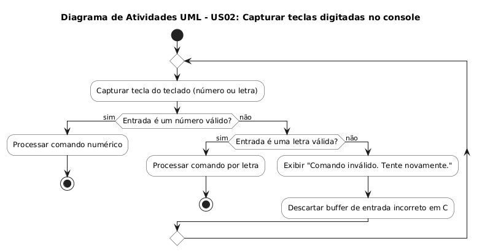
</a>

</details>

<details>
<summary><strong>US03 — Cadastrar o nome do jogador</strong></summary>

### Card
Como jogador, eu quero poder cadastrar um nome de usuário para poder me identificar no jogo e meu progresso ser salvo em associação com o nome escolhido.

### Conversation
O jogador deve conseguir cadastrar um nome de sua escolha que comporte até 3 letras. Os nomes não vão poder se repetir, visto que o progresso de cada jogador estará associado ao nome de usuário.

### Critérios de aceitação
- O nome escolhido aparecer durante a partida.
- A Luci se referir ao jogador pelo nome escolhido.
- O cadastramento não pode permitir nomes repetidos.
- O nome aparecer no ranking junto à pontuação.

[User Story 03 — Trello](assets/trello/us03.png) ([image](https://github.com/lvns1/Utop.ia/raw/main/assets/trello/us03.png))

<a href="assets/diagramas/US_03_diagrama.png">
  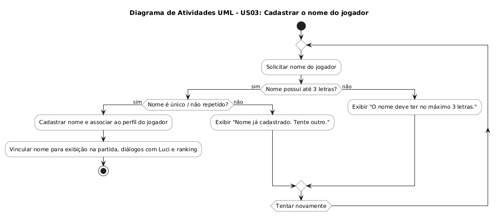
</a>

<a href="assets/sketches/us03_sketch.png">
  
</a>

</details>

<details>
<summary><strong>US04 — Computar o Score</strong></summary>

### Card
Como jogador, quero que o sistema contabilize meus acertos, para calcular a pontuação final da partida de acordo com o meu desempenho.

### Conversation
O score é calculado pela fórmula sugerida: Score = Pontuação dos Puzzles + Bônus do Bloco 1 - Erros.

### Critérios de aceitação
- A pontuação aumenta ao acertar quizzes e puzzles.
- A pontuação diminui ao errar os puzzles.
- O score final acumulado é exibido ao concluir a partida.

[User Story 04 — Trello](assets/trello/us04.png) ([image](https://github.com/lvns1/Utop.ia/raw/main/assets/trello/us04.png))

<a href="assets/diagramas/US_04_diagrama.png">
  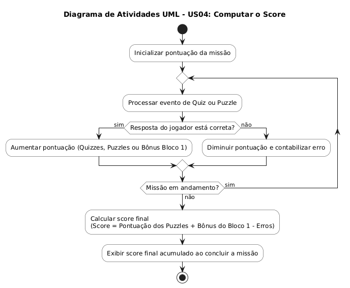
</a>

<a href="assets/sketches/us04_sketch.png">
  
</a>

</details>

<details>
<summary><strong>US05 — Salvar Automaticamente o Progresso (Auto-Save)</strong></summary>

### Card
Como jogador, quero que o meu progresso seja salvo automaticamente após eventos relevantes da partida, para evitar perda de avanço caso o programa seja encerrado de forma inesperada.

### Conversation
O jogo deve gravar os dados no arquivo de persistência ao transitar de bloco ou ao conquistar novos itens no inventário.

### Critérios de aceitação
- O arquivo de save é atualizado automaticamente ao concluir o Bloco 1.
- O arquivo de save é atualizado automaticamente ao obter um item após resolver um puzzle no Bloco 2.

[User Story 05 — Trello](assets/trello/us05.png) ([image](https://github.com/lvns1/Utop.ia/raw/main/assets/trello/us05.png))

<a href="assets/diagramas/US_05_diagrama.png">
  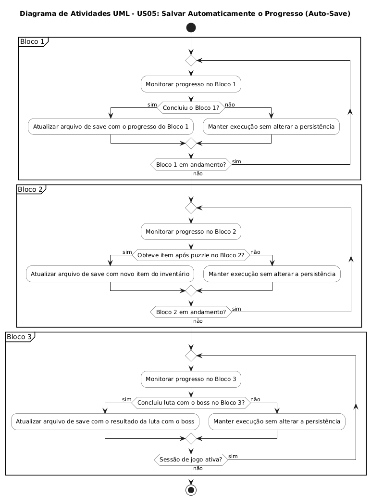
</a>

<a href="assets/sketches/us05_sketch.png">
  
</a>

</details>

<details>
<summary><strong>US06 — Acessar painel com vida, itens e pontuação do jogador</strong></summary>

### Card
Como jogador, quero acompanhar minhas vidas, itens e pontuação atualizados na tela após cada ação, para avaliar o impacto das minhas decisões durante a exploração.

### Conversation
A interface em texto deve exibir um painel fixo de cabeçalho contendo: Vidas restantes (máximo 3), Lista de Itens no Inventário (máximo 3) e Score atual.

### Critérios de aceitação
- O cabeçalho é atualizado e exibido a cada nova renderização de tela.
- Perdas de vida ou aquisição de novos itens refletem no painel imediatamente.
- Se o contador de vidas chegar a 0, aciona a tela de derrota/fim de jogo.

[User Story 06 — Trello](assets/trello/us06.png) ([image](https://github.com/lvns1/Utop.ia/raw/main/assets/trello/us06.png))

<a href="assets/diagramas/US_06_diagrama.png">
  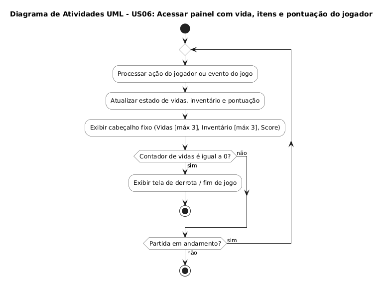
</a>

<a href="assets/sketches/us06_sketch.png">
  
</a>

</details>

<details>
<summary><strong>US07 — Aprender com os Quizzes sobre Alucinação no Bloco 1</strong></summary>

### Card
Como jogador, quero responder a quizzes conceituais sobre alucinação e uso crítico de IA no Bloco 1, para compreender a teoria e acumular um bônus inicial de pontuação.

### Conversation
O Bloco 1 é a passagem inicial e obrigatória (MVP do jogo). Apresenta trechos de conversas de chat com falhas/alucinações de IA para o jogador identificar e escolher a resposta correta.

### Critérios de aceitação
- Apresenta 2 salas sequenciais obrigatórias com perguntas educativas sobre IA.
- Respostas corretas concedem bônus de score inicial.
- Respostas incorretas no Bloco 1 não consomem vidas do jogador.
- Concluir os quizzes do Bloco 1 libera a passagem para o Bloco 2.

[User Story 07 — Trello](assets/trello/us07.png) ([image](https://github.com/lvns1/Utop.ia/raw/main/assets/trello/us07.png))

<a href="assets/diagramas/US_07_diagrama.png">
  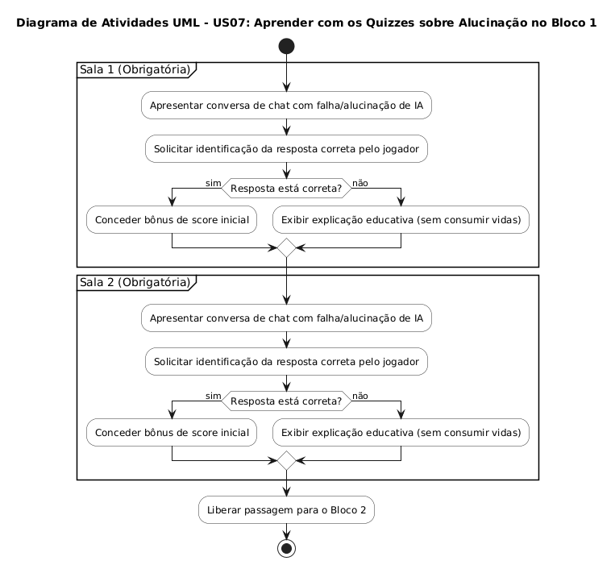
</a>

<a href="assets/sketches/us07_sketch.png">
  
</a>

</details>

<details>
<summary><strong>US08 — Receber instruções da Luci (companion) no Bloco 1</strong></summary>

### Card
Como jogador, quero receber orientações da Luci (companion) no Bloco 1, para compreender o enredo da abdução e os objetivos da jornada.

### Conversation
A mascote/companion se apresenta no início, explica a situação no mundo interno de UtopIA e instrui o jogador sobre como avançar.

### Critérios de aceitação
- Diálogos em texto de Luci introduzem a história antes dos quizzes.
- O avanço dos diálogos exige uma confirmação simples por teclado pelo jogador.

[User Story 08 — Trello](assets/trello/us08.png) ([image](https://github.com/lvns1/Utop.ia/raw/main/assets/trello/us08.png))

<a href="assets/diagramas/US_08_diagrama.png">
  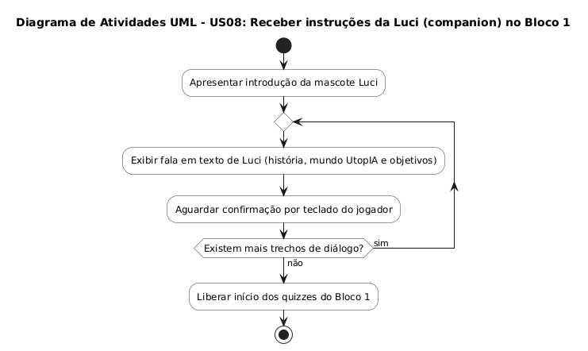
</a>

<a href="assets/sketches/us08_sketch.png">
  
</a>

</details>

<details>
<summary><strong>US09 — Pausar o jogo no estado atual</strong></summary>

### Card
Como jogador, quero poder pausar o estado atual do jogo para conseguir acessar as opções de reiniciar, ver instruções e encerrar sem perder meu progresso.

### Conversation
A pausa do jogo deve exibir um menu próprio contendo as opções de 1 - Reiniciar a partida, 2 - Acessar o box de instruções e 3 - Encerrar. O progresso do jogo deve estar salvo para quando o jogador sair da pausa poder voltar exatamente para onde estava.

### Critérios de aceitação
- A opção "Pausar" grava os dados atuais no arquivo sem corromper a estrutura do texto.
- A opção "Reiniciar" permite voltar ao início do jogo, mas o progresso não ficará salvo.
- A opção "Instruções" mostra um box de texto com as principais regras do jogo.
- A opção "Encerrar" permite sair do jogo.

[User Story 09 — Trello](assets/trello/us09.png) ([image](https://github.com/lvns1/Utop.ia/raw/main/assets/trello/us09.png))

<a href="assets/diagramas/US_09_diagrama.png">
  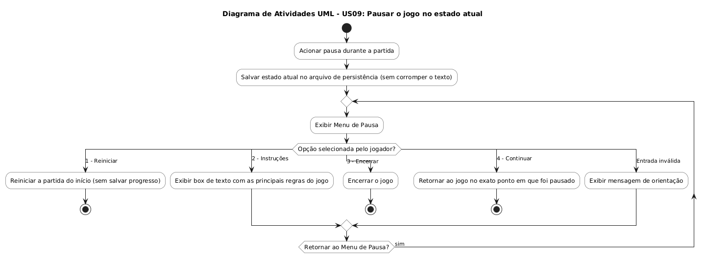
</a>

<a href="assets/sketches/us09_sketch.png">
  
</a>

</details>

<details>
<summary><strong>US10 — Reiniciar a partida</strong></summary>

### Card
Como jogador, eu quero poder reiniciar o jogo através da opção de pausa do estado atual para poder refazer a partida desde o início.

### Conversation
A opção de reiniciar está no menu de pausa e o sistema exibe uma mensagem de confirmação para evitar perdas acidentais de progresso. Após a confirmação do usuário, o programa apaga os dados vinculados ao jogador e permite que se inicie uma nova partida.

### Critérios de aceitação
- A opção "Reiniciar Partida" está disponível no menu de pausa durante o jogo.
- O sistema exige uma confirmação do jogador (ex.: S/N) antes de apagar o progresso atual.
- A confirmação da ação restaura os valores padrões da struct do jogador (vidas, pontuação e inventário) e redireciona para o menu principal no início.

[User Story 10 — Trello](assets/trello/us10.png) ([image](https://github.com/lvns1/Utop.ia/raw/main/assets/trello/us10.png))

<a href="assets/diagramas/US_10_diagrama.png">
  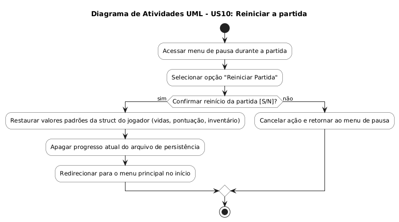
</a>

<a href="assets/sketches/us10_sketch.png">
  
</a>

</details>

<details>
<summary><strong>US11 — Encerrar o jogo</strong></summary>

### Card
Como jogador, quero poder acionar a opção de encerrar o jogo.

### Conversation
O jogador seleciona a opção "Encerrar" através do Menu Principal ou do menu de pausa durante a partida. Exibe uma mensagem de confirmação e o programa é finalizado devolvendo o controle do terminal de forma limpa, sem travamentos ou erros de execução.

### Critérios de aceitação
- A opção de encerrar o jogo está visível e acessível no Menu Principal e no menu de pausa.
- O acionamento do comando abre um box para confirmar a escolha.
- Todos os recursos de memória da aplicação são liberados corretamente (sem memory leaks).
- O sistema exibe uma mensagem de despedida e finaliza o executável com sucesso.

[User Story 11 — Trello](assets/trello/us11.png) ([image](https://github.com/lvns1/Utop.ia/raw/main/assets/trello/us11.png))

<a href="assets/diagramas/US_11_diagrama.png">
  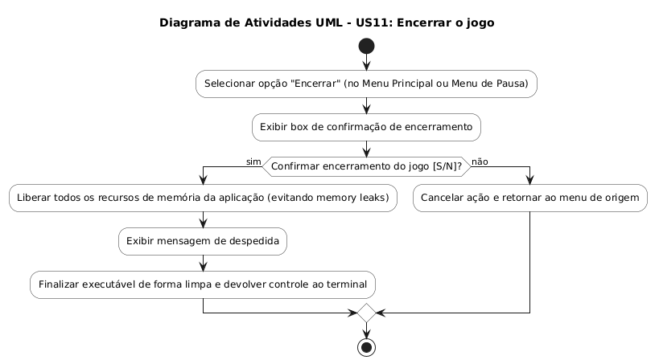
</a>

<a href="assets/sketches/us11_sketch.png">
  
</a>

</details>

<details>
<summary><strong>US12 — Contabilizar ações para simular Janela de Contexto</strong></summary>

### Card
Como jogador, quero que cada movimento e tentativa de puzzle consuma tokens/ações, para que eu precise gerenciar meus passos e evitar perda de vidas.

### Conversation
Simula a limitação da janela de contexto da IA. Movimentos consomem tokens e ultrapassar limites estipulados gera penalidades de vidas.

### Critérios de aceitação
- O contador de ações é incrementado a cada interação/movimento.
- Atingir o limite de ações estipulado para a fase resulta na perda de 1 vida do jogador.
- A perda de 3 vidas implica no game over.

[User Story 12 — Trello](assets/trello/us12.png) ([image](https://github.com/lvns1/Utop.ia/raw/main/assets/trello/us12.png))

<a href="assets/diagramas/US_12_diagrama.png">
  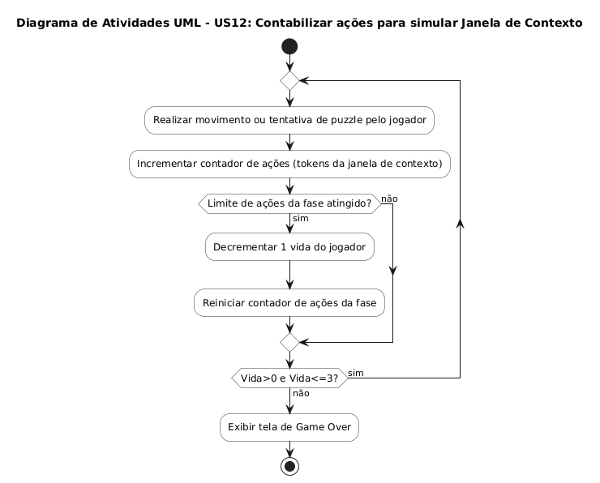
</a>

<a href="assets/sketches/us12_sketch.png">
  
</a>

</details>

<details>
<summary><strong>US13 — Navegar entre Salas no Bloco 2</strong></summary>

### Card
Como jogador, quero selecionar e acessar diferentes salas utilizando o teclado, para explorar os cenários e encontrar pistas e puzzles do Bloco 2.

### Conversation
O mapa do Bloco 2 permite transição entre até 3 salas temáticas (ex: Ética, Fake News, Viés). Cada movimento de transição consome 1 Ação/Token da janela de contexto.

### Critérios de aceitação
- Apresenta opções de navegação baseadas nos caminhos disponíveis a partir da sala atual.
- Cada mudança de ambiente incrementa o contador global de ações/tokens consumidos.

[User Story 13 — Trello](assets/trello/us13.png) ([image](https://github.com/lvns1/Utop.ia/raw/main/assets/trello/us13.png))

<a href="assets/diagramas/US_13_diagrama.png">
  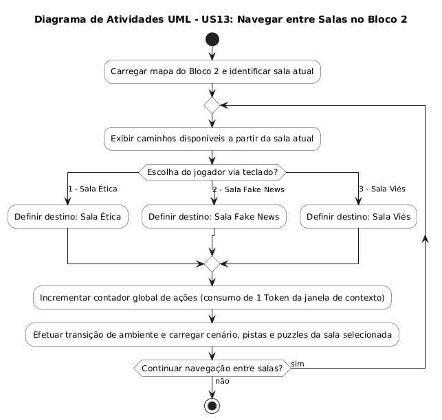
</a>

<a href="assets/sketches/us13_sketch.png">
  
</a>

</details>

<details>
<summary><strong>US14 — Resolver Puzzles de IA no Bloco 2</strong></summary>

### Card
Como jogador, quero investigar baús e objetos nas salas para resolver puzzles e obter itens mágicos ou pergaminhos de prompt.

### Conversation
Ao escolher "Investigar" em uma sala, um puzzle conceitual sobre alucinação é exibido. Resolver o desafio concede um item (ex: pergaminho, espada, poção) necessário para o confronto final.

### Critérios de aceitação
- Ação de investigação exibe o enunciado e as opções de resolução do puzzle.
- A resolução correta adiciona o item correspondente ao inventário do jogador.
- O nível do item concedido é proporcional ao desempenho na resolução do puzzle.

[User Story 14 — Trello](assets/trello/us14.png) ([image](https://github.com/lvns1/Utop.ia/raw/main/assets/trello/us14.png))

<a href="assets/diagramas/US_14_diagrama.png">
  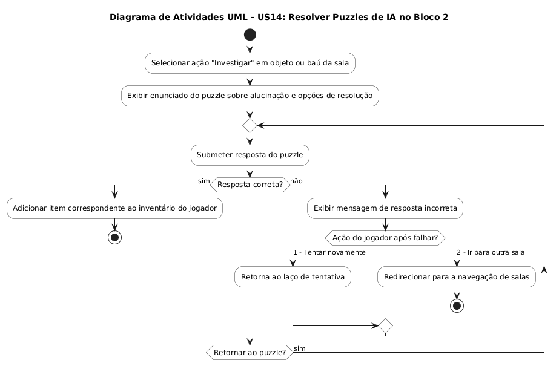
</a>

<a href="assets/sketches/us14_sketch.png">
  
</a>

</details>

<details>
<summary><strong>US15 — Acessar as instruções do jogo</strong></summary>

### Card
Como jogador, eu quero acessar um box com o resumo das principais regras do jogo através da opção de pausar, para poder relembrar o que posso ou não fazer no jogo.

### Conversation
Durante a execução da partida, o jogador aciona o comando de pausa e aparece uma caixa formatada contendo o resumo explicativo das regras, limites de ações, utilidade das vidas e permissões de jogo. Após a leitura, o jogador pressiona qualquer tecla para fechar a caixa e retorna a partida exatamente onde estava.

### Critérios de aceitação
- O comando de pausa é acionado durante qualquer turno do jogo sem fechar o executável.
- A tela exibe um box de texto claro resumindo as regras, dinâmicas permitidas e restrições da partida.
- A confirmação de saída da tela de pausa restabelece o estado do jogo sem perdas de progresso ou falhas de memória.

[User Story 15 — Trello](assets/trello/us15.png) ([image](https://github.com/lvns1/Utop.ia/raw/main/assets/trello/us15.png))

<a href="assets/diagramas/US_15_diagrama.png">
  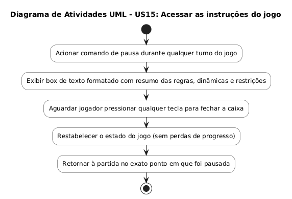
</a>

<a href="assets/sketches/us15_sketch.png">
  
</a>

</details>

<details>
<summary><strong>US16 — Alterar o Comportamento da Companion (Luci)</strong></summary>

### Card
Como jogador, quero que a postura de Luci se altere de acordo com minha pontuação baixa no Bloco 2, para refletir como meus maus hábitos corrompem a IA.

### Conversation
Se o jogador tiver a pontuação diminuída por muitos erros e gastar muitas vidas, Luci passa a dar respostas agressivas ou dicas incorretas/sabotagens, antecipando sua transformação em Boss.

### Critérios de aceitação
- Bom desempenho mantém diálogos colaborativos de Luci.
- Baixa pontuação e alto consumo de vidas altera o estado de Luci para "agressivo/alucinado", modificando seus textos em tela.

[User Story 16 — Trello](assets/trello/us16.png) ([image](https://github.com/lvns1/Utop.ia/raw/main/assets/trello/us16.png))

<a href="assets/diagramas/US_16_diagrama.png">
  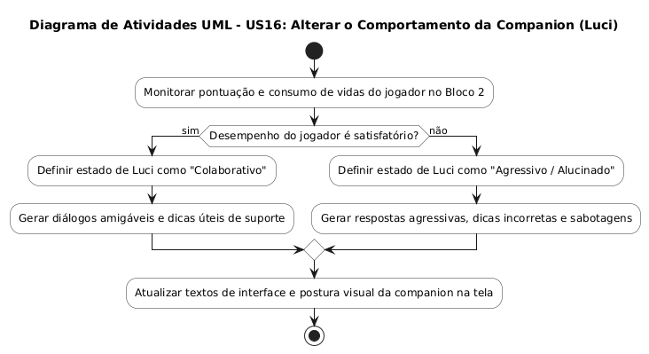
</a>

<a href="assets/sketches/us16_sketch.png">
  
</a>

</details>

<details>
<summary><strong>US17 — Adaptar o Confronto Final com Boss no Bloco 3</strong></summary>

### Card
Como jogador, quero acessar a batalha do Bloco 3 quando possuir os itens necessários, enfrentando um Boss com dificuldade adaptada ao meu histórico.

### Conversation
Requer no mínimo 1 item coletado para liberar o Bloco 3. O Boss final revela-se como a própria Luci corrompida. Se o jogador teve bom desempenho, o Boss possui menor vida/dificuldade; se teve mau desempenho, a batalha é intensificada.

### Critérios de aceitação
- Bloqueia a entrada no Bloco 3 caso o jogador possua apenas 1 item.
- Define os parâmetros de vida e ataque do Boss com base no histórico de acertos e vidas restantes do jogador.

[User Story 17 — Trello](assets/trello/us17.png) ([image](https://github.com/lvns1/Utop.ia/raw/main/assets/trello/us17.png))

<a href="assets/diagramas/US_17_diagrama.png">
  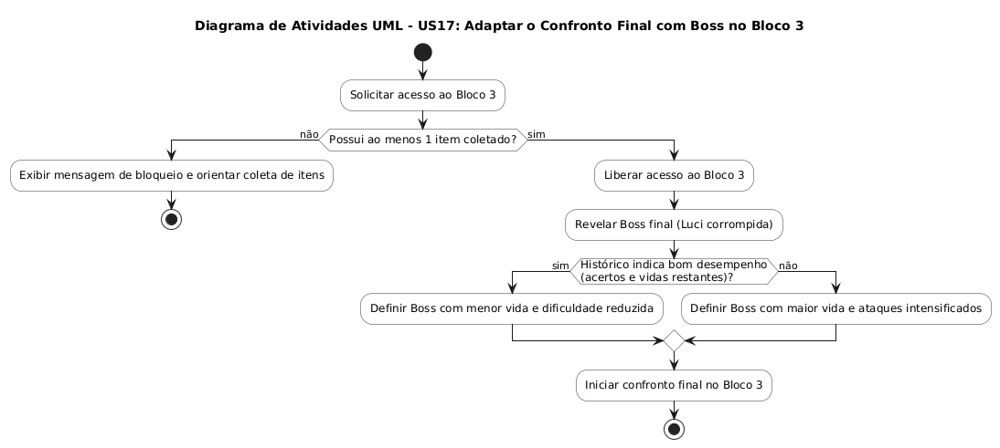
</a>

<a href="assets/sketches/us17_sketch.png">
  
</a>

</details>

<details>
<summary><strong>US18 — Usar Itens e Conhecimentos na Batalha Final</strong></summary>

### Card
Como jogador, quero utilizar os itens e conhecimentos obtidos durante a exploração na batalha final, para conseguir normalizar ou derrotar a IA alucinada.

### Conversation
O menu de combate apresenta opções associadas aos itens do inventário (ex: "Usar Pergaminho de Prompt Preciso"). A ordem ou escolha correta do item aplica o dano/efetividade no Boss.

### Critérios de aceitação
- Opções especiais de combate só ficam disponíveis se o item correspondente estiver no inventário.
- O uso do item correto reduz os pontos de vida/alucinação do Boss.

[User Story 18 — Trello](assets/trello/us18.png) ([image](https://github.com/lvns1/Utop.ia/raw/main/assets/trello/us18.png))

<a href="assets/diagramas/US_18_diagrama.png">
  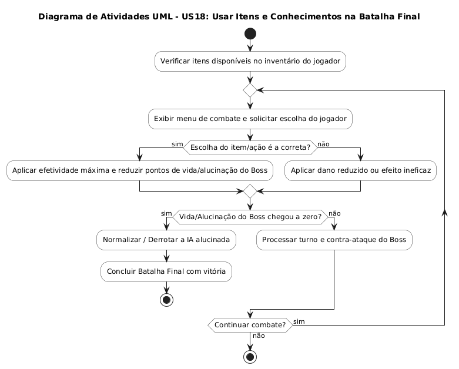
</a>

<a href="assets/sketches/us18_sketch.png">
  
</a>

</details>

<details>
<summary><strong>US19 — Acessar ranking com a pontuação</strong></summary>

### Card
Como jogador, quero acessar um ranking contendo a minha pontuação e o meu nome de usuário ao final da partida, para comparar meu desempenho e acompanhar minha posição.

### Conversation
Ao finalizar a partida (por vitória ou Game Over), o sistema renderiza uma tela formatada com a lista de pontuações organizadas da maior para a menor, permitindo a leitura clara do nome e do score antes de retornar ao menu principal.

### Critérios de aceitação
- A tela de ranking exibe a lista de pontuações ordenadas juntamente com os respectivos nomes dos jogadores.
- A visualização da tabela no terminal é legível e oferece uma opção clara para retornar ao menu principal e encerrar a partida.

[User Story 19 — Trello](assets/trello/us19.png) ([image](https://github.com/lvns1/Utop.ia/raw/main/assets/trello/us19.png))

<a href="assets/diagramas/US_19_diagrama.png">
  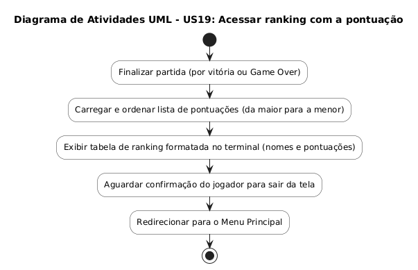
</a>

<a href="assets/sketches/us19_sketch.png">
  
</a>

</details>

### 📅 Organização e Acompanhamento do projeto

O desenvolvimento do UtopIA foi acompanhado ao longo das semanas por meio do Jira, permitindo organizar as atividades, acompanhar o progresso e visualizar a evolução do projeto durante o desenvolvimento.

### 📅 Evolução do desenvolvimento

<p align="center">
  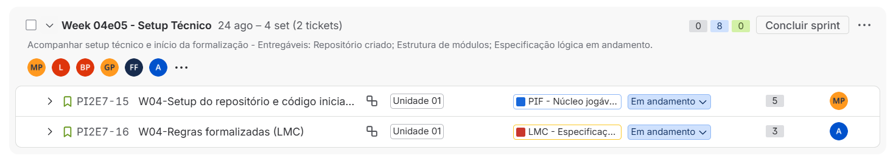
</p>

<p align="center">
  <em>Organização das atividades e andamento do projeto — semanas 4 e 5.</em>
</p>

<p align="center">
  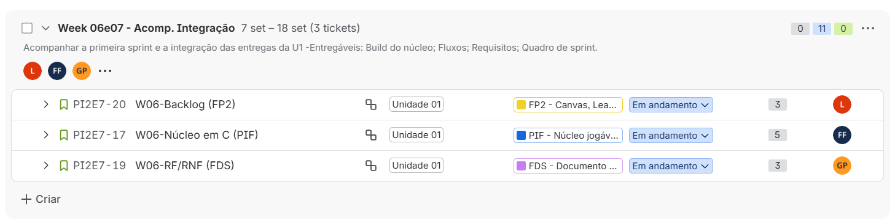
</p>

<p align="center">
  <em>Acompanhamento do desenvolvimento — semanas 6 e 7.</em>
</p>

<p align="center">
  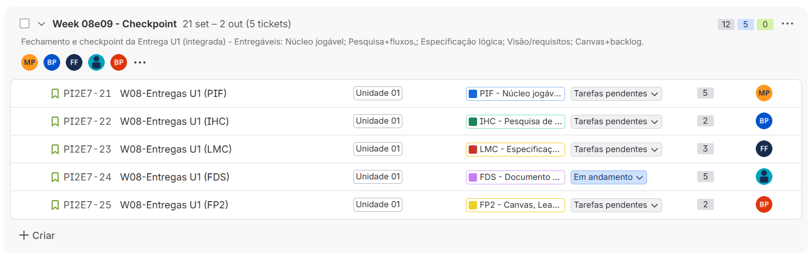
</p>

<p align="center">
  <em>Acompanhamento do desenvolvimento — semanas 8 e 9.</em>
</p>

<p align="center">
  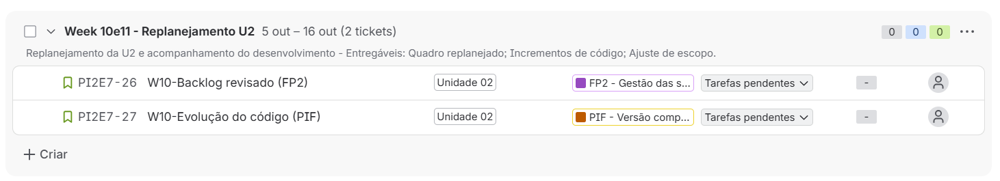
</p>

<p align="center">
  <em>Acompanhamento do desenvolvimento — semanas 10 e 11.</em>
</p>

<p align="center">
  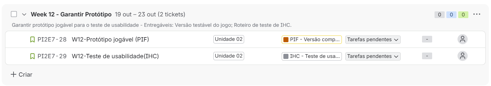
</p>

<p align="center">
  <em>Acompanhamento do desenvolvimento — semana 12.</em>
</p>

<p align="center">
  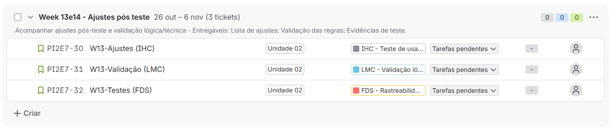
</p>

<p align="center">
  <em>Acompanhamento do desenvolvimento — semanas 13 e 14.</em>
</p>

<p align="center">
  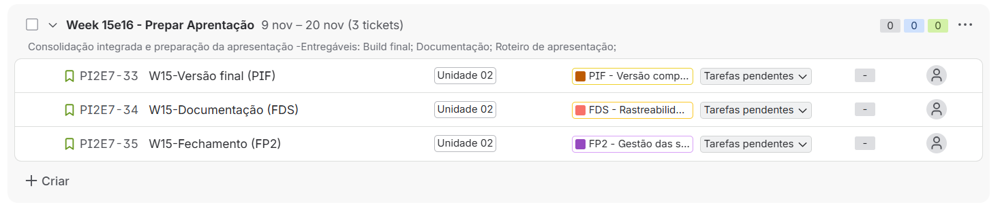
</p>

<p align="center">
  <em>Acompanhamento do desenvolvimento — semanas 15 e 16.</em>
</p>

<p align="center">
  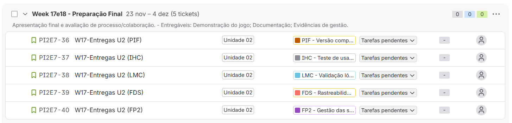
</p>

<p align="center">
  <em>Acompanhamento do desenvolvimento — semanas 17 e 18.</em>
</p>

---

## 👥 Equipe

1. **🎨 Interface Humano-Computador (IHC)**

   * **Filipe:** Desenvolvedor front end
   * **Brenda Paiva:** Pesquisadora de IHC e UI/UX Designer
   * **Áurea:** Visual Designer

2. **💻 Programação Imperativa e Funcional (PIF)**

   * **Messias:** Desenvolvedor Core
   * **Lucas:** Desenvolvedor de Algoritmos
   * **Brenna:** Desenvolvedora de Sistemas

3. **🏗️ Fundamentos de Desenvolvimento de Software (FDS)**

   * **Ardilles:** Arquiteto de Software
   * **Gabriel:** Scrum Master / Project Owner
   * **Brenna:** QA Engineer

4. **🧠 Lógica**

   * **Lucas:** Designer de Puzzles
   * **Gabriel:** Engenheiro de Regras
   * **Brenna:** Analista de Conteúdo

---

## 📚 Projeto Acadêmico

Projeto desenvolvido como parte do **Projeto Integrador**, unindo diferentes áreas de conhecimento para a criação de uma experiência interativa de educação sobre Inteligência Artificial.

---

<div align="center">

### 🧠 UTOPIA

**Uma jornada para descobrir que nem toda resposta que parece inteligente está correta.**

🎮 **Aprenda • Questione • Explore • Combata • Sobreviva**

</div>
